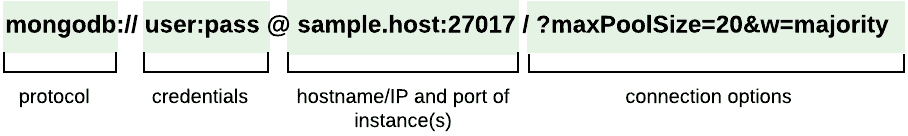
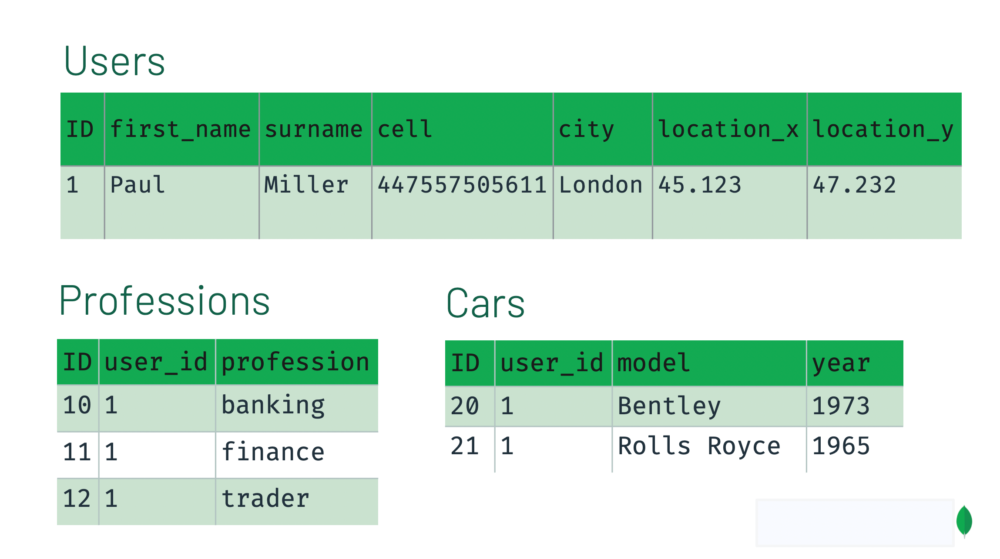

# Content Learning week 1 in MIRAWAY
## Compare `Sql` and `NoSql` Database

|           | SQL          |   NoSQL      |
|-----------|--------------|------------:|
| Định nghĩa    | Cơ sở dữ liệu SQL chủ yếu được gọi là RDBMS hoặc Cơ sở dữ liệu quan hệ | Cơ sở dữ liệu NoSQL chủ yếu được gọi là cơ sở dữ liệu không liên quan hoặc phân tán|
| Query |   Structured query language (SQL) | Không có ngôn ngữ query|
| Type | SQL databases là cơ sở dữ liệu dựa trên bảng| NoSQL databases có thể dựa trên tài liệu, cặp khóa-giá trị, cơ sở dữ liệu biểu đồ|
| Schema| SQL databases có lược đồ được xác định trước|  NoSQL databases sử dụng lược đồ động cho dữ liệu phi cấu trúc.|
| Khả năng mở rộng| SQL databases có thể mở rộng theo chiều dọc| NoSQL databases có thể mở rộng theo chiều ngang|
|Phù hợp cho| Đây là 1 lựa chọn lý tưởng cho môi trường truy vấn phức tạp| Không phù hợp với truy vấn phức tạp|
|Lưu trữ dữ liệu phân cấp| SQL databases không thích hợp cho việc lưu trữ dữ liệu phân cấp.| hù hợp hơn cho kho lưu trữ dữ liệu phân cấp vì nó hỗ trợ phương thức cặp khóa-giá trị.|
|Tính nhất quán| Nó phải được cấu hình cho sự nhất quán chặt chẽ.| Nó phụ thuộc vào DBMS như một số cung cấp tính nhất quán mạnh mẽ như MongoDB, trong khi những người khác cung cấp chỉ cung cấp sự nhất quán cuối cùng, như Cassandra.|
|Được sử dụng tốt nhất cho| RDBMS database là tùy chọn thích hợp để giải quyết các vấn đề về ACID.|NoSQL được sử dụng tốt nhất để giải quyết các vấn đề về tính khả dụng của dữ liệu|
|Sử dụng|Nó nên được sử dụng khi hiệu lực dữ liệu là siêu quan trọng| Sử dụng khi nó quan trọng hơn để có dữ liệu nhanh hơn dữ liệu chính xác|
|Tốt cho| Khi bạn cần hỗ trợ truy vấn động| Sử dụng khi bạn cần mở rộng quy mô dựa trên yêu cầu thay đổi|
|Tính năng tốt nhất| Hỗ trợ đa nền tảng, Bảo mật và miễn phí| Dễ sử dụng, hiệu suất cao và công cụ linh hoạt.|
|Mô hình ACID và BASE| ACID (Atomicity, nhất quán, cách ly và độ bền) là một chuẩn cho RDBMS|Cơ bản (Về cơ bản có sẵn, trạng thái mềm, phù hợp cuối cùng) là một mô hình của nhiều hệ thống NoSQL|
| Performance| SQL hoạt động tốt và nhanh thì việc desgin tốt là cực kì quan trọng và ngược lại.| Nhanh hơn SQL NoSQL thì denormalized cho phép bạn lấy được tất cả thông tin về một item cụ thể với các codition mà không cần JOIN liên quan hoặc truy vấn SQL phức tạp.|
|Kết luận|	Dự án đã có yêu cầu dữ liệu rõ ràng xác định quan hệ logic có thể được xác định trước.|Phù hợp với những dự án yêu cầu dữ liệu không liên quan, khó xác định, đơn giản mềm dẻo khi đang phát triển|

### Khi nào nên sử dụng SQL?
* SQL là ngôn ngữ đơn giản nhất được sử dụng để giao tiếp với RDBMS
* Phân tích các phiên liên quan đến hành vi và tùy chỉnh
* Tạo trang tổng quan tùy chỉnh
* Nó cho phép bạn lưu trữ và lấy dữ liệu từ cơ sở dữ liệu một cách nhanh chóng
* Được ưu tiên khi bạn muốn sử dụng các phép nối và thực hiện các truy vấn phức tạp

### Khi nào nên sử dụng NoSQL?
* Khi không cần hỗ trợ ACID
* Khi mô hình RDBMS truyền thống không đủ
* Dữ liệu cần lược đồ linh hoạt
* Các ràng buộc và logic xác thực không bắt buộc phải được thực hiện trong cơ sở dữ liệu
* Ghi nhật ký dữ liệu từ các nguồn được phân phối
* Nó nên được sử dụng để lưu trữ dữ liệu tạm thời như giỏ mua hàng, danh sách mong muốn và dữ liệu phiên

## Learning `Mongodb` database
**1. Define:**
* MongoDB là một CSDL mã nguồn mở và là CSDL `NoSQL` hàng đầu, được hàng triệu người sử dụng. 
    MongoDB được viết bằng C++.
* Ngoài ra, MongoDB là một CSDL đa nền tảng, hoạt động trên các khái niệm `Collection` và `Document`, nó cung cấp hiệu suất cao, tính khả dụng cao và khả năng mở rộng dễ dàng.

**2. Keyword**
* `Collection`: Được xem như 1 table trong CSDL SQL. Tuy nhiên Collecion trong MongoDB không cần khai báo cột cũng như kiểu dữ liệu trước.
* `Document`: Là 1 bản ghi trong Colletion tương ứng với 1 row trong CSDL SQL
* `_id`: Trường bắt buộc có trong mỗi `document` và sẽ được sinh ra mỗi khi tạo 1 `document` và là duy nhất cũng được xem như khóa chính của 1 `document`.
* `Cursor`: Con trỏ đến tập kết quả của 1 truy vấn

**3. Data type MongoDB**

| Type        | Alias |
|-------------|------:|
| Double      | “double” |
| String      | “string”|
| Object      | “object” |
| Array       | “array” |
| Binary data | “binData” |
| Undefined | “undefined”|
| ObjectId      | “objectId” |
| Boolean      | 	“bool”|
| Date      | “date” |
| Null       | “null” |
| Regular Expression | “regex” |
| DBPointer | “dbPointer” |
| JavaScript  | “javascript” |
| Symbol      | “symbol” |
| JavaScript (with scope) | “javascriptWithScope” |
| 32-bit integer | “int” |
| 64-bit integer | “long” |
| Decimal128 | “decimal”|
| Min key | “int” |
| 64-bit integer | “minKey” |
| Max key | “maxKey” |

**4. Advantage of MongoDB**
* Ít schema hơn: Vì schema được sinh ra là để nhóm các đối tượng vào 1 cụm, dễ quản lý.
* Cấu trúc của một đối tượng rõ ràng.
* Khả năng mở rộng cực lớn: việc mở rộng dữ liệu mà không phải lo đến các vấn đề như khóa ngoại, khóa chính, kiểm tra ràng buộc, ... MongoDB cho phép thực hiện replication và sharding nên việc mở rộng cũng thuận lợi hơn.
* Sử dụng bộ nhớ trong để lưu giữ cửa sổ làm việc cho phép truy cập dữ liệu nhanh hơn. Việc cập nhật được thực hiện nhanh gọn nhờ update tại chỗ (in-place).
* Không có các Join phức tạp.

**5. Note when using mongodb database**
* Ứng dụng cần những gì? Cần phải quan tâm đến yêu cầu của ứng dụng, dữ liệu và kiểu dữ liệu nào sẽ cần cho ứng dụng của bạn. Dựa trên các yếu tố đó để đảm bảo rằng cấu trúc Document của bạn đã được xây dựng phù hợp.
* Các mẫu truy vấn dữ liệu của bạn là gì? Bạn cần phải xem xét các truy vấn dữ liệu của ứng dụng để cân nhắc sử dụng Index một cách hiệu quả.
* Có thường xuyên phải Insert, update, remove dữ liệu không? Nếu có hãy xem xét lại phần đánh chỉ mục hoặc sử dụng sharding để có thể tối ưu việc sử dụng MongoDB trong ứng dụng của bạn.

### Connection `Golang` with `Mongodb`
**1. URL for connect to MongoDB**



**2. Driver for connect `Golang` with `Mongodb`**

Download package driver to connect to mongodb
``` Go
go get go.mongodb.org/mongo-driver/mongo
```

**3. Connect to mongodb with golang using mongo driver package**

``` GO
import (
"context"
"time"

"go.mongodb.org/mongo-driver/mongo"
"go.mongodb.org/mongo-driver/mongo/options"
"go.mongodb.org/mongo-driver/mongo/readpref"
)

ctx, cancel := context.WithTimeout(context.Background(), 10*time.Second)
defer cancel()
client, err := mongo.Connect(ctx, options.Client().ApplyURI("mongodb://localhost:27017"))
```
 Remember Disconnect when stop program
``` Go
defer func() {
    if err = client.Disconnect(ctx); err != nil {
        panic(err)
    }
}()
```
Using Ping() function to check connector to mongodb
``` Go
ctx, cancel = context.WithTimeout(context.Background(), 2*time.Second)
defer cancel()
err = client.Ping(ctx, readpref.Primary())
```
[Link for golang driver package connect to mongodb](https://github.com/mongodb/mongo-go-driver)
### How to query `Mongodb` in `Golang`

[Link to github project](https://github.com/namlk173/go-mongodb)

**Several simple query to mongodb database using database**

**Data model i used**
``` Go
package model

import "go.mongodb.org/mongo-driver/bson/primitive"

type Author struct {
    ID        primitive.ObjectID `json:"_id,omitempty" bson:"_id,omitempty"`
    FirstName string             `json:"first_name,omitempty" bson:"first_name,omitempty"`
    LastName  string             `json:"last_name,omitempty" bson:"last_name,omitempty"`
    Address   string             `json:"address,omitempty" bson:"address,omitempty"`
    IsDeleted bool               `json:"is_deleted" bson:"is_deleted"`
}

type AuthorWrite struct {
    FirstName string `json:"first_name,omitempty" bson:"first_name,omitempty"`
    LastName  string `json:"last_name,omitempty" bson:"last_name,omitempty"`
    Address   string `json:"address,omitempty" bson:"address,omitempty"`
    IsDeleted bool   `json:"is_deleted" bson:"is_deleted"`
}
```

``` Go
package model

import "go.mongodb.org/mongo-driver/bson/primitive"

type Document struct {
    ID       interface{} `json:"_id,omitempty" bson:"_id,omitempty"`
    Title    string      `json:"title,omitempty" bson:"title,omitempty"`
    Pages    uint        `json:"pages,omitempty" bson:"pages,omitempty"`
    Language string      `json:"language,omitempty" bson:"language,omitempty"`
    Author   []Author    `json:"author,omitempty" bson:"author,omitempty"`
}

type DocumentWrite struct {
    Title    string               `json:"title,omitempty" bson:"title,omitempty"`
    Pages    uint                 `json:"pages,omitempty" bson:"pages,omitempty"`
    Language string               `json:"language,omitempty" bson:"language,omitempty"`
    AuthorID []primitive.ObjectID `json:"author_id" bson:"author_id"`
}
```
**1. Insert Data into mongo database**
``` Go
func (r *authorRepository) InsertAuthor(author *model.AuthorWrite) (interface{}, error) {
    ctx, cancel := context.WithTimeout(context.Background(), time.Second*5)
    defer cancel()

    collection := r.db.Client.Database("go-mongodb").Collection("author")
    res, err := collection.InsertOne(ctx, author)
    if err != nil {
    return primitive.ObjectID{}, err
    }

    return res.InsertedID, nil
}
```

**2. Get data from mongodb**
* Find All document Using cursor pointer and function All()
``` Go
func (r *authorRepository) ListAllAuthor(skip, limit int64) ([]model.Author, error) {
    ctx, cancel := context.WithTimeout(context.Background(), time.Second*5)
    defer cancel()

    var authors []model.Author
    collection := r.db.Client.Database("go-mongodb").Collection("author")
    opt := options.Find().SetLimit(limit).SetSkip(skip)
    cur, err := collection.Find(ctx, bson.D{{"is_deleted", false}}, opt)
    if err != nil {
    return []model.Author{}, err
    }
    defer cur.Close(ctx)

    if err = cur.All(ctx, &authors); err != nil {
    return []model.Author{}, err
    }

    if err = cur.Err(); err != nil {
    return []model.Author{}, err
    }

    return authors, nil
}
```
* Find One document
``` Go
func (r *authorRepository) GetAuthorDetail(objectID interface{}) (*model.Author, error) {
    ctx, cancel := context.WithTimeout(context.Background(), time.Second*5)
    defer cancel()

    collection := r.db.Client.Database("go-mongodb").Collection("author")
    var author model.Author
    filter := bson.M{"_id": objectID, "is_deleted": false}
    err := collection.FindOne(ctx, filter).Decode(&author)
    if err != nil {
    return &model.Author{}, err
    }

    return &author, nil
}
```
* Using cursor and Next() function to get document one by one.
``` Go
var existAuthor []model.Author
for cur.Next(ctx) {
    var document model.Document
    err := cur.Decode(&document)
    if err != nil {
        return []model.Document{}, err
    }

        // Filter authors have is_deleted = false and remove authors have is_deleted field = true
        // Using golang to modifier Author in document
        // Need a sub query option to get author didn't be deleted.
    for _, author := range document.Author {
        if !author.IsDeleted {
            existAuthor = append(existAuthor, author)
        }
    }

    document.Author = existAuthor
    documents = append(documents, document)
}
```

**3. Deleted one document**

Update field ís_deleted in author object be True
``` Go
func (r *authorRepository) DeleteAuthor(objectID interface{}) error {
    ctx, cancel := context.WithTimeout(context.Background(), time.Second*5)
    defer cancel()

    collection := r.db.Client.Database("go-mongodb").Collection("author")
    filter := bson.M{"_id": objectID}
    updateQuery := bson.D{{"$set", bson.D{{"is_deleted", true}}}}
    _, err := collection.UpdateOne(ctx, filter, updateQuery)
    if err != nil {
    return err
    }

    return nil
}
```

**4. Update Document**
* Using replaceOne function
``` Go
func (r *authorRepository) UpdateAuthor(author *model.Author) error {
    ctx, cancel := context.WithTimeout(context.Background(), time.Second*5)
    defer cancel()

    collection := r.db.Client.Database("go-mongodb").Collection("author")
    filter := bson.M{"_id": author.ID}
    _, err := collection.ReplaceOne(ctx, filter, author)
    if err != nil {
    return err
    }

    return nil
}
```
## Learning `Mongodb` relationships between `Documents`
Phụ thuộc vào từng project và từng thiết kế database khác nhau mà chúng ta sẽ có các cách thiết kế quan hệ khác nhau cho các document.

**1. Summary**

Schema Design Approaches – Relational vs. MongoDB

**Relational approach**


Ở đây chúng ta đã chia database thành 3 table khác nhau và có thể sử dụng câu lệnh `JOIN` sử dụng trường `user_id` để lấy ra được các dữ liệu cần thiết.

**MongoDB Schema Design**
``` Json
{
"first_name": "Paul",
"surname": "Miller",
"cell": "447557505611",
"city": "London",
"location": [45.123, 47.232],
"profession": ["banking", "finance", "trader"],
"cars": [
    {
        "model": "Bentley",
        "year": 1973
    },
    {
        "model": "Rolls Royce",
        "year": 1965
    }
    ]
}
```
Chúng ta có thể thấy thay vì chia dữ liệu thành các bảng khác nhau thì chúng ta đã gộp dữ liệu thành 1 bảng duy nhất bằng cách nhúng các đối tượng lại với nhau.
Bằng cách này chúng ta chỉ cần sử dụng 1 câu query đơn giản để có thế lấy được dữ liệu.

Với thiết kế mongodb database:
* Không có quy tắc
* Không có thuật toán
* Không có quy trình chính thức

Khi thiết kế mongo database chúng ta nên xem xét:
* Lưu trữ dữ liệu
* Hiệu năng truy nhập dữ liệu
* Hareware phù hợp, hợp lý.

**2. Embedding vs. Referencing**

Chúng ta có 2 lựa chọn cho việc nhúng data vào 1 object:
* Embedding: Nhúng trực tiếp 1 object vào 1 object khác
* Referencing: Nhúng khóa của 1 object vào 1 object khác. Khi cần lấy dữ liệu thì chúng ta sẽ dùng câu lệnh `$lookup` để kết hợp dữ liệu lại với nhau, tương tự như `JOIN` trong `SQL`

**3. Embedding**

**Advantages:**
* Có thể lấy ra toàn bộ dữ liệu bằng 1 query duy nhất
* tránh phải sử dụng `$lookup` để lấy dữ liệu (Truy nhập trên các bảng khác nhau)
* Update dữ liệu liên quan bằng 1 câu lệnh nguyên tử duy nhất
* Có thể sử dụng transactions operator để thực hiện các câu lệnh khác nhau.

**Limitations**
* Khi nhúng các trường là các object lơn mà ít giá trị làm cho chi phí lưu trữ trở nên rất lớn. Chúng ta có thể tăng hiệu suất truy vấn bằng cách giới hạn kích thước của các bản ghi cho mỗi truy vấn.
* Mỗi bản ghi chỉ có giới hạn 16MB nên khi nhúng như thế sẽ rất dễ dẫn tới quá giá hạn lưu trữ và mất dữ liệu.

**4. Referencing**

Thiết kế document này referencing đến 1 document khác sử dụng khóa `document's
unique object ID` và connect chúng sử dụng phương thức `$lookup` Giống với phương thức JOIN trong SQL. Nó cho phép chúng ta chia nhỏ các bảng dữ liệu để truy vấn hiệu quả hơn và có thể mở rộng dễ dàng nhưng vẫn duy trì các mỗi quan hệ giữa chúng.

**Advantages:**
* Các bảng dữ liệu sẽ được chia nhỏ hơn
* Khó có thể đạt đến mốc giới hạn 16MB
* Các thông tin không cần thiết sẽ không cần truy nhập trong từng query
* Giảm việc trùng lặp dữ liệu


**Limitations**
* Phải sử dụng câu lệnh `$lookup` nên cần ít nhất 2 queries để lấy ra toàn bộ dữ liệu cần thiết

**5. Type of relationships**

* **One-to-One**

``` JSON
{
    "_id": "ObjectId('AAA')",
    "name": "Joe Karlsson",
    "company": "MongoDB",
    "twitter": "@JoeKarlsson1",
    "twitch": "joe_karlsson",
    "tiktok": "joekarlsson",
    "website": "joekarlsson.com"
}
```
Ví dụ mỗi user chỉ có 1 name duy nhất. Chúng ta có thể tạo tất cả các trường dữ liệu của document bằng các cặp `key-value`.

Trong trường hợp này chúng ta nên ưu tiên embedding trong document

* **One-to-Few**

    1 vài dữ liệu liên quan đến 1 object
``` JSON
{
    "_id": "ObjectId('AAA')",
    "name": "Joe Karlsson",
    "company": "MongoDB",
    "twitter": "@JoeKarlsson1",
    "twitch": "joe_karlsson",
    "tiktok": "joekarlsson",
    "website": "joekarlsson.com",
    "addresses": [
        { "street": "123 Sesame St", "city": "Anytown", "cc": "USA" },
        { "street": "123 Avenue Q",  "city": "New York", "cc": "USA" }
    ]
}
```
Ở đây mỗi user sẽ có 1 vài địa chỉ nhất định.
Trong trường hợp này chúng ta vânx ưu tiên `embedding`

    **RULE 1**
    * Luôn ưu tiên embedding nếu không có lý do để không embedding
    * Nói chung chúng ta nên embedding data vào document. Chúng ta chỉ nên dùng referencing nếu có lý do: Ví dụ như là nó quá lớn hoặc nhiều để embedding, Hoặc là chúng ta ít khi cần đến giá trj này.

* One-to-Many
``` JSON
// PRODUCT OBJECT
{
    "name": "left-handed smoke shifter",
    "manufacturer": "Acme Corp",
    "catalog_number": "1234",
    "parts": ["ObjectID('AAAA')", "ObjectID('BBBB')", "ObjectID('CCCC')"]
}
```

``` JSON
// PART OBJECT
{
    "_id" : "ObjectID('AAAA')",
    "partno" : "123-aff-456",
    "name" : "#4 grommet",
    "qty": "94",
    "cost": "0.94",
    "price":" 3.99"
}
```
Với trường hợp này chúng ta có mỗi `product object` sẽ chứa rất nhiều `part object`. Và trong mỗi query chúng ta không cần lấy hết thông tin về các phần này.
TUy nhiên chúng ta vẫn phải lưu dữ liệu về các phần này.
Vì vậy chúng ta sẽ lưu 1 mảng objectID của các phần này để liên kết đến các phần được lưu trong các bảng khác.

    **RULE 2**
    Nếu cần truy cập vào 1 đối tượng riêng
    ví dụ như part Object trong những query khác thì chúng ta
    nên tách ra thành các bảng riêng và sử dụng cách referencing

    **RULE 3**
    Tránh sử dụng $lookup queries nhưng vẫn nên sử dụng nếu nó cho chúng ta
    1 lược đồ tốt hơn.

* One-to-Squillions (1 với vài triệu)

Việc lưu trữ dữ liệu trong 1 mảng không có giới hạn của 1 đối tượng là rất nguy hiểm nó có thể vưượt quá limit 16MB bất kể lúc nào kể cả việc chỉ lưu ObjectID của các đối tượng khác.

Trường hợp này chúng ta nên sử dụng cách tiếp cận ngược lại.

**HOST**
``` JSON
{
    "_id": ObjectID("AAAB"),
    "name": "goofy.example.com",
    "ipaddr": "127.66.66.66"
}
```

**MESSAGE**
``` JSON
{
    "time": ISODate("2014-03-28T09:42:41.382Z"),
    "message": "cpu is on fire!",
    "host": ObjectID("AAAB")
}
```

Thay vì chúng ta lưu 1 mảng chứa tất cả `messaage` object của 1 `HOST` chúng ta nên tạo ra các document lưu trữ các `message` và các `message` này sẽ chứa khóa dến các `HOST` cuả các `message` này.

    **RULE 4**
    Mảng chứa các đối tượng. Nếu mảng này có thể có vài trăm phần từ thì không nên embedding. Nếu có nhiều hơn vài nghìn thì không nên referencing ObjectID mà phải dùng cách khác.

    **RULE 5**
    Cách tạo mô hình dự hoàn toàn vào các dữ liệu trong từng ví dụ cụ thể của chúng ta và không có 1 chuẩn chung nào cả.


* Many-to-Many
``` JSON
{
    "_id": ObjectID("AAF1"),
    "name": "Kate Monster",
    "tasks": [ObjectID("ADF9"), ObjectID("AE02"), ObjectID("AE73")]
}
```

``` JSON
{
    "_id": ObjectID("ADF9"),
    "description": "Write blog post about MongoDB schema design",
    "due_date": ISODate("2014-04-01"),
    "owners": [ObjectID("AAF1"), ObjectID("BB3G")]
}
```

**RECAP**
*   One-to-One - Prefer key value pairs within the document
*   One-to-Few - Prefer embedding
*   One-to-Many - Prefer embedding
*   One-to-Squillions - Prefer Referencing
*   Many-to-Many - Prefer Referencing

Trong trường hợp này mỗi `user` sẽ có nhiều `task` và mỗi `task` lại có nhiều `user` nên chúng ra sẽ có 1 sub-array chứa linked đến các `task` cho mỗi `user` và 1 sub-array linked đến các `user` cho mỗi `task`.
## The way using `Session` and `Transactions` of `Mongodb` with `Golang`
### Transaction:
* **Transactions** cho phép bạn chạy một loạt hoạt động nhưng sẽ không thay đổi bất kỳ dữ liệu nào cho đến khi `Transaction` được `commit`. Nếu bất kỳ hành động nào trong `transactions` không thành công, Transactions sẽ được `rollback` và tất cả các hành đọngo trước đấy sẽ bị hủy bỏ.
*  Trong mongoDB. `Transactions` sẽ được chạy trong những Session. Một `Session` là một nhóm các thao tác đọc, ghi có liên quan mà bạn thực hiện, Session cho phép tính năng nhất quán cho 1 tập hợp các thao tác hoặc cho phéo thưcj thi các hoạt đôngj trong 1 ACID transaction.
* MongoDB đảm bảo rằng dữ liệu liên quan đến transactions của bạn vẫn còn, ngay cả khi hoạt động gặp lỗi không mong muốn.

* Với Go Driver, bạn có thể tạo SESSION mới từ CLIENT instance và sẽ luôn có 1 phiên được khởi tạo mặc định khi tạo Client.


## SET UP GOROOT Golang
## DEBUGGING Golang
## Create API Golang with Gorrila/mux package
